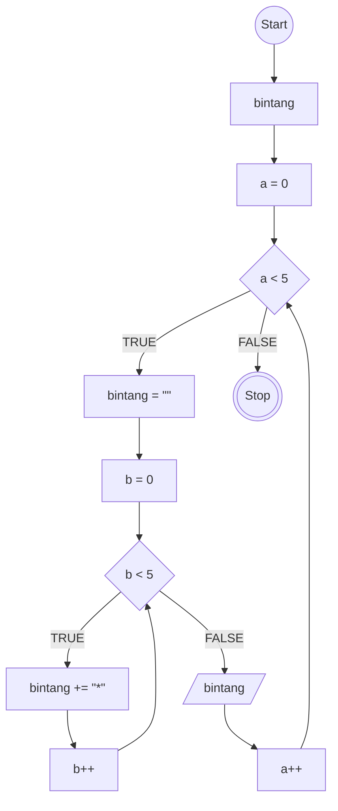
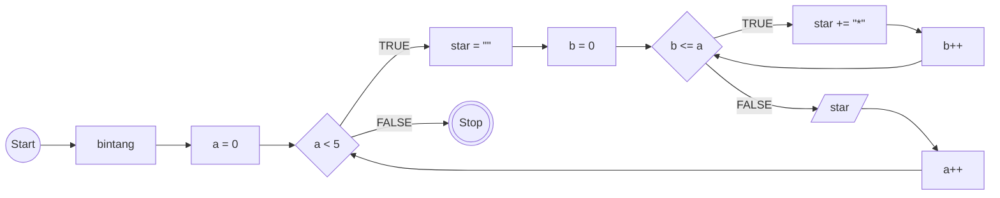

```mermaid
    flowchart TD
    A@{ shape: circle, label: "Start" }
    B@{ shape: rect, label: "bintang" }

    C@{ shape: rect, label: "a = 0" }
    D@{ shape: diamond, label: "a < 5" }
    E@{ shape: rect, label: "bintang = #quot;#quot;" }

    F@{ shape: rect, label: "b = 0" }
    G@{ shape: diamond, label: "b < 5" }
    H@{ shape: rect, label: "bintang += #quot;*#quot;" }
    I@{ shape: rect, label: "b++" }
    J@{ shape: rect, label: "a++" }
    K@{ shape: lean-r, label: "bintang" }
    L@{ shape: dbl-circ, label: "Stop" }

    A --> B
    B --> C
    C --> D
    D --TRUE--> E
    E --> F
    F --> G
    G --TRUE--> H
    H --> I
    I --> G
    G --FALSE--> K
    K --> J
    J --> D
    D --FALSE--> L
```

### output:
```
*****
*****
*****
*****
*****
```


```mermaid
    flowchart LR
    A@{ shape: circle, label: "Start" }
    B@{ shape: rect, label: "bintang" }

    C@{ shape: rect, label: "a = 0" }
    D@{ shape: diamond, label: "a < 5" }
    E@{ shape: rect, label: "star = #quot;#quot;" }

    F@{ shape: rect, label: "b = 0" }
    G@{ shape: diamond, label: "b <= a" }
    H@{ shape: rect, label: "star += #quot;*#quot;" }
    I@{ shape: rect, label: "b++" }
    J@{ shape: rect, label: "a++" }
    K@{ shape: lean-r, label: "star" }
    L@{ shape: dbl-circ, label: "Stop" }

    A --> B
    B --> C
    C --> D
    D --TRUE--> E
    E --> F
    F --> G
    G --TRUE--> H
    H --> I
    I --> G
    G --FALSE--> K
    K --> J
    J --> D
    D --FALSE--> L
```

### output:
```
*
**
***
****
*****
```
