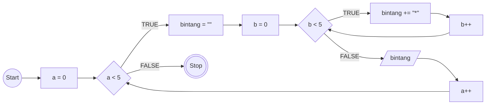
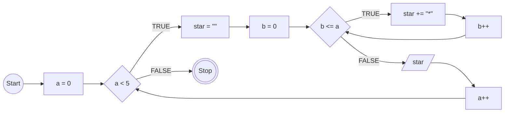
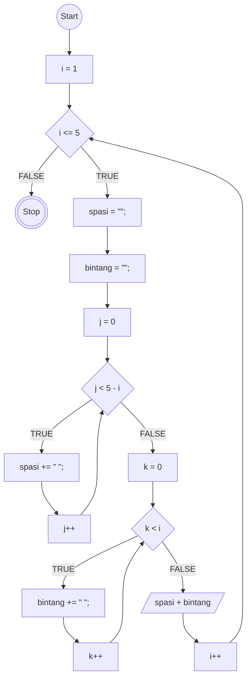
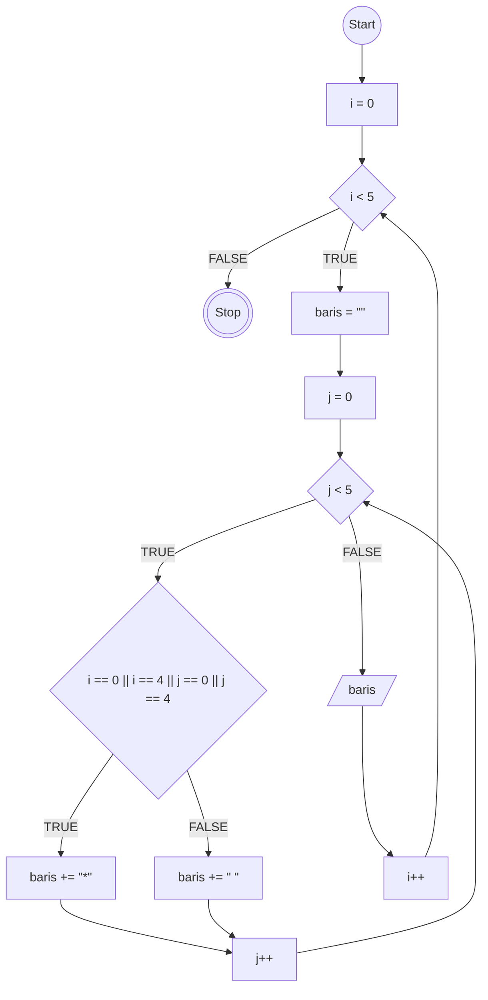

```mermaid
    flowchart LR
    A@{ shape: circle, label: "Start" }

    C@{ shape: rect, label: "a = 0" }
    D@{ shape: diamond, label: "a < 5" }
    E@{ shape: rect, label: "bintang = #quot;#quot;" }

    F@{ shape: rect, label: "b = 0" }
    G@{ shape: diamond, label: "b < 5" }
    H@{ shape: rect, label: "bintang += #quot;*#quot;" }
    I@{ shape: rect, label: "b++" }
    J@{ shape: rect, label: "a++" }
    K@{ shape: lean-r, label: "bintang" }
    L@{ shape: dbl-circ, label: "Stop" }

    A --> C
    C --> D
    D --TRUE--> E
    E --> F
    F --> G
    G --TRUE--> H
    H --> I
    I --> G
    G --FALSE--> K
    K --> J
    J --> D
    D --FALSE--> L
```

### output:
```
*****
*****
*****
*****
*****
```


```mermaid
    flowchart LR
    A@{ shape: circle, label: "Start" }

    C@{ shape: rect, label: "a = 0" }
    D@{ shape: diamond, label: "a < 5" }
    E@{ shape: rect, label: "star = #quot;#quot;" }

    F@{ shape: rect, label: "b = 0" }
    G@{ shape: diamond, label: "b <= a" }
    H@{ shape: rect, label: "star += #quot;*#quot;" }
    I@{ shape: rect, label: "b++" }
    J@{ shape: rect, label: "a++" }
    K@{ shape: lean-r, label: "star" }
    L@{ shape: dbl-circ, label: "Stop" }

    A --> C
    C --> D
    D --TRUE--> E
    E --> F
    F --> G
    G --TRUE--> H
    H --> I
    I --> G
    G --FALSE--> K
    K --> J
    J --> D
    D --FALSE--> L
```

### output:
```
*
**
***
****
*****
```


``` mermaid
    flowchart TD
    
    start((Start))
    stop(((Stop)))

    I[i = 1]
    J[j = 0]
    K[k = 0]
    spasi[spasi = #quot;#quot;;]
    bintang[bintang = #quot;#quot;;]
    addSpasi[spasi += #quot; #quot;;]
    addBintang[bintang += #quot; #quot;;]
    output[/spasi + bintang/]

    iteI[i++]
    iteJ[j++]
    iteK[k++]

    konI{i <= 5}   
    konJ{j < 5 - i}   
    konK{k < i}

    start --> I
    I --> konI   
    konI --TRUE--> spasi
    spasi --> bintang
    bintang --> J
    J --> konJ
    konJ --TRUE--> addSpasi
    addSpasi --> iteJ
    iteJ --> konJ
    konJ --FALSE--> K
    K --> konK
    konK --TRUE--> addBintang
    addBintang --> iteK
    iteK --> konK
    konK --FALSE--> output
    output --> iteI
    iteI --> konI
    konI --FALSE--> stop

```

```
    *
   * *
  * * *
 * * * *
* * * * *
```


``` mermaid
flowchart TD
    start((Start))
    stop(((Stop)))

    I[i = 0]
    J[j = 0]

    baris[baris = #quot;#quot;]
    addBaris1[baris += #quot;*#quot;]
    addBaris2[baris += #quot; #quot;]
    output[/baris/]

    iteI[i++]
    iteJ[j++]
    konI{i < 5}
    konJ{j < 5}
    cekIJ{"i == 0 || i == 4 || j == 0 || j == 4"}

    start --> I
    I --> konI
    konI --TRUE--> baris
    baris --> J
    J --> konJ
    konJ --TRUE--> cekIJ
    cekIJ --TRUE--> addBaris1
    cekIJ --FALSE--> addBaris2
    addBaris1 & addBaris2 --> iteJ
    iteJ --> konJ
    konJ --FALSE--> output
    output --> iteI
    iteI --> konI
    konI --FALSE--> stop

```

```
*****
*   *
*   *
*   *
*****
```
